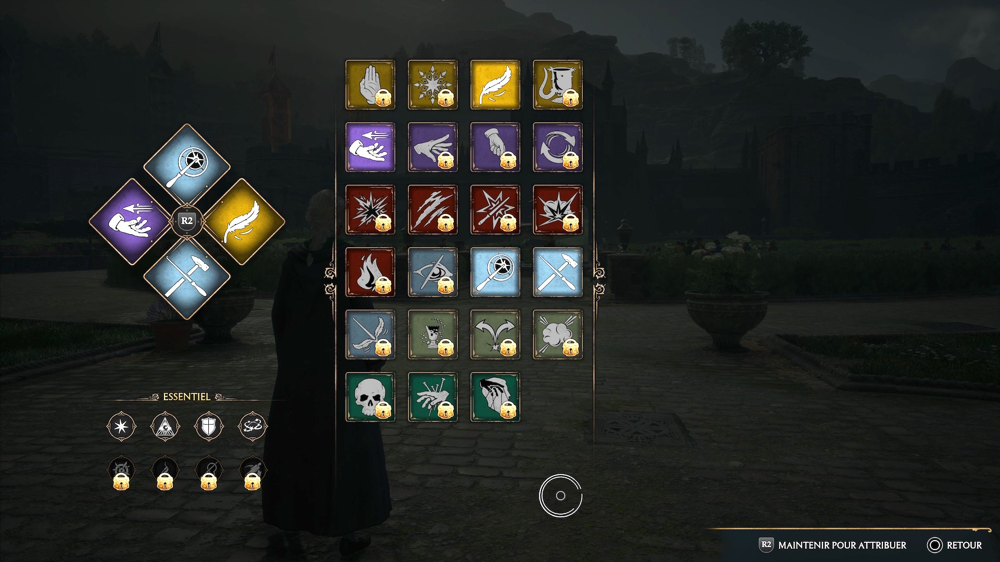

# Hogwarts-Legacy

## Résumé 

L'intrigue se déroule dans l'univers étendu de fantasy imaginé par J. K. Rowling pour les romans Harry Potter et les films Les Animaux fantastiques. Elle suit l'évolution d'un sorcier ou d'une sorcière, c'est-à-dire la personne qui joue au jeu, au sein de l'école de sorcellerie de Poudlard, à la fin des années 1800, soit antérieurement aux événements des deux séries de Rowling.

La première phase du jeu est une phase d'intégration et de découverte de Poudlard, de ses cours de magie et des environs du domaine. Le personnage incarné, doté d'une magie ancienne et singulière, est intégré directement en cinquième année d'études, et apprend à développer ses capacités magiques en lançant divers sortilèges, en préparant des potions et en apprivoisant des animaux fantastiques.

Au cours de sa progression dans le jeu, le personnage comprend que la magie particulière qu'il détient est convoitée par les gobelins et les mages noirs pour détruire le monde des sorciers.

Les histoires s'adaptent au parcours choisi par la personne qui joue et il est possible de sélectionner ses compagnons pour évoluer dans le jeu.

## Bande son

### Musique

La musique principale est composée par Alexander Horowitz. Plusieurs autres compositeurs sont aussi mentionnés, tels que Peter Murray et J. Scott Rakozy. Pour la création de la bande-son, l'équipe des compositions musicales a utilisé des instruments particuliers, comme une pièce de tôle géante nommée « feuille de tonnerre », ainsi qu'un waterphone pour émettre des sons évoquant la magie. Peter Murray précise pour sa part que l'équipe a équilibré la composition de la nouvelle bande originale avec celle des films du Wizarding World.

Sur le morceau Overture to the Unwritten, partagé sur YouTube en décembre 2022, les membres de la chorale et de l'orchestre sont composés d'étudiants de l'Université de l'Utah, de BYU et du Salt Lake Symphony Orchestra, ainsi que d'artistes tels que Nicole Pinnell, Nicole Klossner, Ryan Shupe, Abe Kaelin, Bart Olson, John Knudsen et Dune Moss.

Le jeu propose une musique changeante en fonction de l'emplacement du personnage, avec des différences notables dans des salles communes spécifiques.

### Doublages

Parmi les comédiens notables, l'acteur Simon Pegg, connu pour son interprétation du personnage principal dans le film Shaun of the Dead, prête sa voix à Phineas Nigellus Black, le directeur de Poudlard. Lesley Nicol, rendue célèbre par son rôle de la cuisinière Madame Patemore dans Downton Abbey, double la directrice de Gryffondor Matilda Weasley, tandis que Luke Youngblood (qui interprétait Lee Jordan dans les films Harry Potter) prête sa voix à un élève farceur de la maison Serdaigle, Everett Clopton. L'acteur américain Jason Anthony Griffith, connu pour avoir été la voix de Shadow dans Sonic X, prête ici sa voix au fantôme Nick Quasi-Sans-Tête et au choixpeau magique. L'avatar du personnage principal est doublé soit par Sebastian Croft, soit par la vidéaste britannique Amelia Gething (en).

Pour la version en français, Martin Faliu ou Adeline Chetail prêtent leur voix au personnage principal. Cédric Dumond, la voix française la plus régulière de Simon Pegg, prête donc ici sa voix au personnage de Phineas Nigellus Black. Brigitte Vitudes double la directrice adjointe Matilda Weasley, et Charlie Beaubourg, le Choixpeau. Quant à Annie Milon, qui est la voix française régulière de Halle Berry, elle prête ici sa voix au professeur Onai, qui enseigne la divination. Le compagnon de route Serdaigle, Amit Thakar, sera doublé par Taric Mehani, connu pour avoir prêté sa voix à Luke Skywalker dans Star Wars Battlefront

## Gameplay 

Des mages noirs et des gobelins circulent régulièrement aux abords du village de Pré-au-Lard. Le personnage peut être amené à les croiser, et choisir de les combattre ou de les éviter.

Une vingtaine de sorts sont appris au cours de l'histoire, et il en existe trois types : les sorts de contrôle, les sorts de dégâts et les sorts de force. Les ennemis affichent parfois des boucliers de couleur autour d'eux, qui permettent d’identifier quel type de sort il convient d'utiliser pour les atteindre. Le personnage principal, quant à lui, affiche un halo de lumière autour de sa tête lorsqu'il est sur le point d'être attaqué. Le niveau de santé du personnage est indiqué par une barre verte située dans le coin inférieur droit de l'écran.

En situation de combat, il y a possibilité de dévier les attaques à distance, contre-attaquer et enchaîner plusieurs combinaisons de sortilèges (Accio, Stupéfix, Incendio, etc.). L'ensemble des sortilèges appris peuvent être utilisés à tour de rôle grâce à un système de « roue » de sortilèges (affichée près de la barre de vie, en bas à droite de l'écran) qui permet de lancer rapidement le sort de son choix. Il est possible d'ajuster la puissance des sorts et d'obtenir jusqu'à quatre roues différentes de sortilèges pour varier les sorts lancés et y accéder plus rapidement. Le State of Play promotionnel du jeu, diffusé en mars 2022, indique que les compétences acquises en sortilèges permettent « d'exploiter plus facilement les faiblesses des ennemis »6. La personne qui joue a la possibilité de développer son propre style de combat et recourir, si elle le souhaite, à la magie noire.

Le jeu ne comporte pas de gameplay en ligne ou coopératif.

